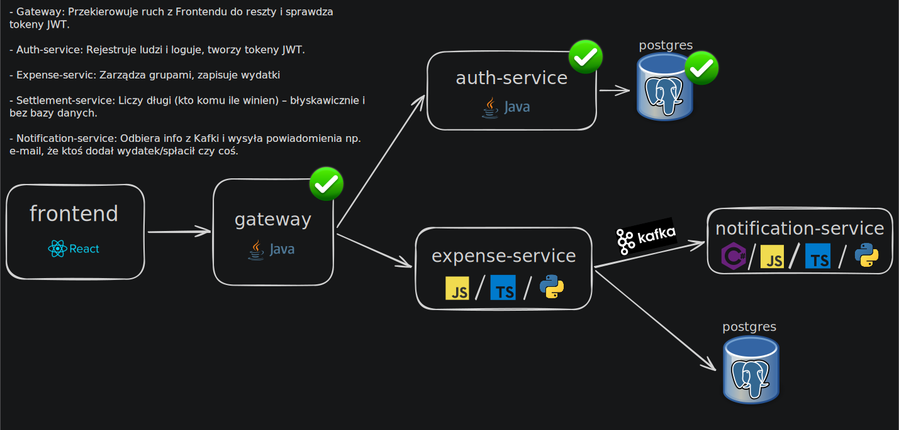

Aby uruchomić aplikację, wystarczy wykonać poniższą komendę:

`docker compose up --build`

Następnie otwórz przeglądarkę i przejdź pod adres:

http://localhost:3000

Skrzynka mailowa jest dostępna pod adresem:

http://localhost:8025
